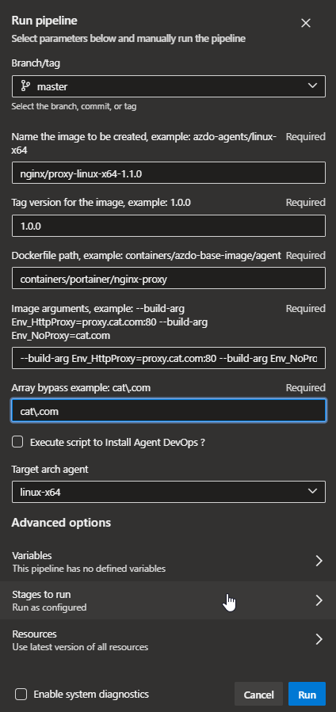

#Esse nginx é customizado e a referencia de uso esta na documentação do portainer

- Para criar nova imagem do nginx-proxy



---
---

Para usar no modo interativo: `podman run --rm -it`

```bash
podman run -d \
    -p 443:443 \
    -e VIRTUAL_HOST=portainer.ecorp.nuuvify.com \
    -e VIRTUAL_PROTO=https \
    -e VIRTUAL_PORT=443 \
    -v /userapps/certificados:/etc/nginx/ssl \
    -v /userapps/configs/nginx_config:/etc/nginx/conf.d \
    -v /userapps/var/log/nginx:/var/log/nginx \
    -v /var/run/docker.sock:/tmp/docker.sock \
    --network=cbl \
    --network-alias=nginx-proxy \
    --name nginx-proxy \
    cat-docker.artifacts.nuuvify.com/cat_brazil-jfrog/nginx/proxy-linux-x64-1.1.0:9.9.9
```