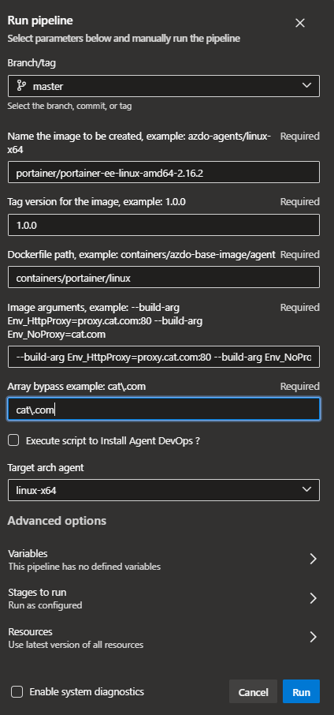
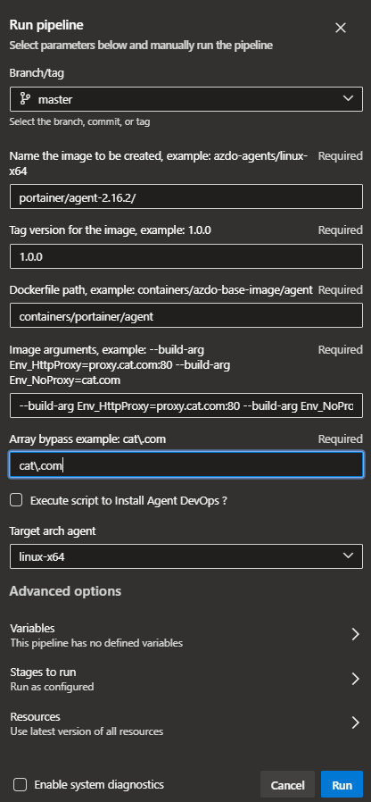

1 - Criar uma imagem nova

- Portainer docker standalone




---
- Portainer docker agent



---
---

2 - Para executar o portainer atras de um proxy reverso (NGINX)

```
sudo su -

podman network create cbl

podman volume create \
  portainer_data

podman run -d \
   -p 9443:443 \
   -e VIRTUAL_HOST=portainer.ecorp.nuuvify.com \
   -e VIRTUAL_PROTO=https \
   -e VIRTUAL_PORT=443 \
   -v /var/run/docker.sock:/var/run/docker.sock \
   -v portainer_data:/data \
   -h unix:///var/run/docker.sock \
   --network=cbl \
   --network-alias=portainer \
   --name portainer \
   cat-docker.artifacts.nuuvify.com/cat_brazil-jfrog/portainer/portainer-ee-linux-amd64-2.14.1:9.9.9
```

3 - Para instalar o agent do portainer em outro servidor para gerenciar pelo portainer

```
sudo su -

podman network create \
  portainer_agent_network

podman volume create \
  portainer_data

podman run -d \
  -p 9001:9001/tcp \
  -v /userapps/var/lib/containers/storage/volumes:/var/lib/docker/volumes \  
  -v /var/run/docker.sock:/var/run/docker.sock \
  --network=portainer_agent_network \
  --name portainer_agent \
  cat-docker.artifacts.nuuvify.com/cat_brazil-jfrog/portainer/agent-2.14.1:9.9.9
```